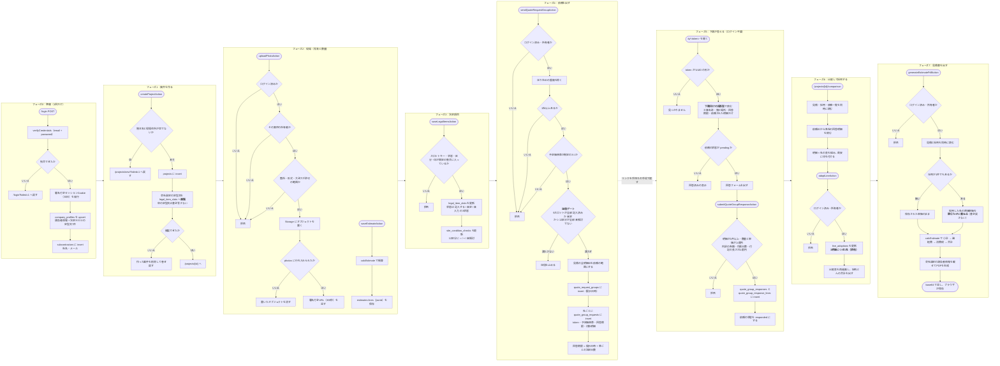
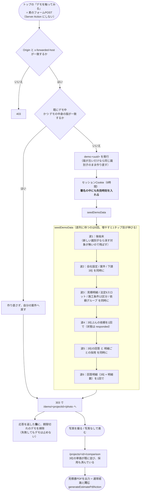
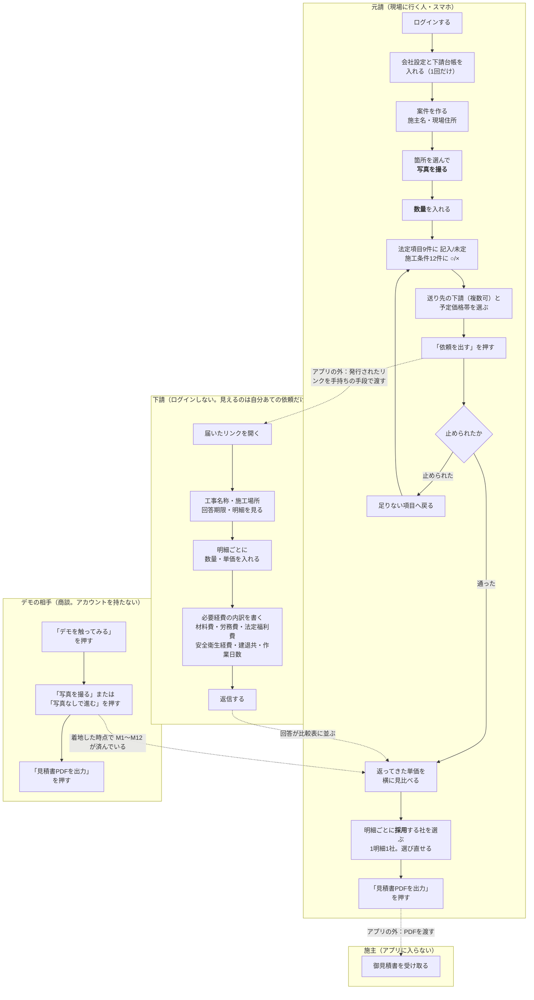
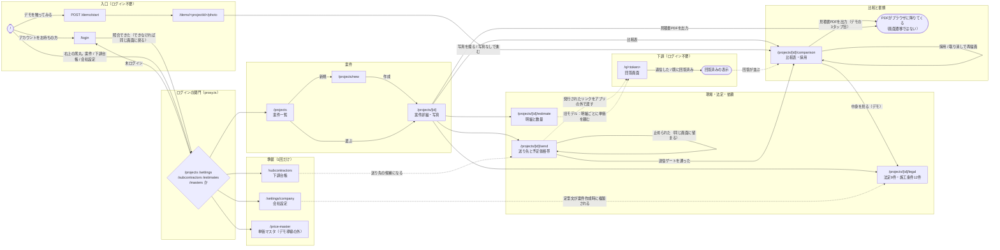

# flows（全工程のフロー）

**まず「0. 全工程（16工程）」を読む。そこが正。** 図はその下にあり、
食い違ったら文字のほうが正しい。**利用者と話すときは、文字のフローの言葉で話す。**

この文書は実装（`apps/web/`）から起こした工程の記録である。製品として何を決めたかは
`docs/design.md` が正で、ここには**決定を書かない**（同じ決定を2箇所に書くと、片方だけ
古くなったときにどちらが正か分からなくなる。`AGENTS.md`「結合を増やさない」1）。

ここが持つのは「**誰がいつ何をするか**」と「**いま実装が、どの順で何を通るか**」である。
**この2つがずれている箇所は「いまの実装が、上のとおりになっていない箇所」に明記する**
（隠すと、次に触る人が図を信じて実装済みだと思い込む）。値・文言・判定条件の
実体は各図の下に置き場所を書いた。**経路を変えたらこの文書も同時に直す。**

対象範囲：**デモ経路と通常経路の両方**。両者は別のアプリではなく、
**同じ工程を、入力を飛ばして通るか、人が埋めながら通るかの違い**でしかない。

---

## 0. まず言語化する（図の前に、言葉で全工程）

### 登場するのは3者

| 誰 | ログイン | 触る画面 | 何をする |
|---|---|---|---|
| **元請** | **要る**（`/q` 以外の保護対象） | 案件・写真・法定項目・依頼・比較表・見積書 | 現場を撮り、数量を入れ、下請に依頼し、返ってきた単価を採用し、施主向けの見積書を出す |
| **下請** | **要らない**（token だけが資格情報） | `/q/<token>` のみ | 依頼された明細に数量・単価を入れ、必要経費の内訳を添えて返す |
| **施主** | — | 無し（アプリに入らない） | 出来上がった御見積書PDFを受け取る |

保護範囲は `apps/web/proxy.ts` の `PROTECTED_PREFIXES`（`/projects` `/estimates`
`/masters` `/settings` `/subcontractors`）1箇所が正。

### 全工程（16工程。これが正）

**まず、誰がいつ何をするかを、そのままの言葉で書く。** 図はこの下にあるが、
**食い違ったらこちらが正**。利用者（元請の実務者）と話すときはこの言葉で話す。

**流れは1本。フェーズで切らない。** 1から16まで順に進む。
各行の頭の【　】は、その工程が誰の・いつの作業かを示すだけで、区切りではない。

```
 1. 【事前】 自社の設定をする
              会社名・代表者名・住所を入れる
              法定項目の定型文（毎回同じ文章）を入れる

 2. 【事前】 下請けを登録する
              会社名とメールアドレスを、頼む会社のぶんだけ登録する

 3. 【現場】 案件をつくる
              施主名と現場住所を入れる
              ここに写真も見積もりも全部ぶら下がる

 4. 【現場】 現場で写真を撮る
              箇所（内装・外壁・屋根…）を選んで撮る

 5. 【現場】 写真をはめ込んだ書類になる
              撮った写真が、そのまま見積依頼書の枠に入る
              数量だけ打つ（工事名・単位は箇所ごとに決まっている）

 6. 【現場】 法定項目を埋める
              建設業法で決まっている21項目
              1 の定型文が初期値として入っているので、直すだけ

 7. 【現場】 下請けに送る前に確認する
              21項目に空きがあると、アプリが送らせない
              頼む会社を選ぶ／予定価格帯を選ぶ（見積期間が決まる）

 8. 【現場】 下請けに送る
              選んだ会社ぶんの依頼が、それぞれ別のリンクとして発行される

 9. 【下請】 書類が届く
              リンクを開くだけ。ログインしない
              見えるのは工事名・施工場所・工事内容・法定項目
              見えないのは施主名・他社の単価・こちらの売価

10. 【下請】 見積もりを作る
              工事ごとに数量と単価を入れる
              必要経費の内訳（法定福利費など）も入れられる

11. 【下請】 見積もりの確認をする
              入れた内容を見直す

12. 【下請】 見積もりを送る
              1回だけ。送ったあとは書き換えられない

13. 【見積】 下請けからの見積もりを受け取る
              返ってきた会社から順に、比較表に並ぶ

14. 【見積】 見積もり比較、決定
              工事ごとに3社の単価が横に並ぶ
              最安に印が付くが、自動では決まらない
              工事ごとに1社ずつ「採用」を押す（別々の会社を選べる）

15. 【見積】 下請け見積もりを基に顧客向け見積もりを作る
              採用した単価がそのまま顧客向けの見積になる
              諸経費率を入れる

16. 【見積】 顧客向け見積もりを印刷する
              見積書PDFを出す
```

**この番号を、この先の文書・会話・作業の指し方にする。**
「工程5が繋がっていない」「工程8と9の間が無い」のように番号で指す。

### いまの実装が、上のとおりになっていない箇所（3つ）

**フローが正で、実装が追いついていない。** 埋めるまでは、この3つを口頭で補う。

| 工程 | いまの実装 |
|---|---|
| **工程5 写真をはめ込んだ書類になる** | **なっていない。** 書類画面（`/projects/spike-document`）は固定のサンプルのままで、案件と繋がっていない。数量は見積エディタで入れる |
| **工程8→9 送る／届く** | **メール送信の実装はゼロ。** リンクを発行するだけで、渡すのは人（手段は未決。`docs/design.md` 7章） |
| **工程11 下請けが確認する** | **確認の画面が無い。** 入力してそのまま送信になる |

### 各工程が実装のどこを通るか

**工程1 自社の設定** … `/settings/company`。請負者情報（書類の印字欄）と、法定④⑥⑧の
定型文7スロット。**この2つが空だと後段が成立しない**（印字欄が空になり、依頼の宛先も選べない）。

**工程2 下請けを登録** … `/subcontractors`。社名とメール。

**工程3 案件をつくる** … 作成と同時に、会社設定の定型文がその案件の法定項目スロットへ
**複製される**（参照ではない。参照だと、会社設定を直した瞬間に既に送った案件の内容まで
遡って変わる）。空の定型文は書き写さない（空で書くと「未入力」ではなく「記入済みで中身が空」に
なり、送信ゲートの意味が変わる）。複製に失敗したら案件ごと消して巻き戻す。

**工程4 写真を撮る** … ブラウザ側で圧縮してから送り、サーバは
**認証 → 所有者確認 → 箇所の検証 → 形式の検証 → 大きさの検証**を通してから
Storage に置き、`photos` に行を入れる。行の作成に失敗したらオブジェクトを消す
（逆順にすると、参照されない実体が残る）。表示は300秒の署名付きURL。

**工程6 法定項目を埋める** … 9スロットに **3状態**（記入する／未定を明示／未入力）、
施工条件・範囲リスト12区分に **○／×**。「未定」は利用者が明示的に選んだときだけ入る値で、
入力し忘れの穴埋めには使わない。

**工程7 送る前に確認する** … **送信ゲート**。9スロットが全部「記入済み」か「未定を明示」で、
12区分が全部「未検討」でないこと。**画面とは別にサーバでもう一度**判定する
（Server Action は直接叩けるため）。

**工程8 下請けに送る** … 依頼グループを作り、社ごとに
**token・予定価格帯・回答期限・対象明細の範囲**を持つ依頼を作る。
回答期限は「提示日時＋帯ごとの法定日数」（建設業法施行令第6条）。

**工程9〜12 下請けが答える** … `/q/<token>`。見えるのは工事名称・施工場所・回答期限・
依頼された明細だけで、施主名・売価・掛率・原価・他社の単価は
**そもそも戻り値の型に入っていない**。回答すると依頼の状態が `responded` になり、
2回目以降は「回答済み」の表示になる。

**工程13〜14 比較して採用する** … 明細を縦、社を横に並べる。最安に印が付くが自動では選ばない。
**1明細につき採用は1社まで**で、明細ごとに違う社を採れる。選び直しも取り消しもできる。
採用ぶんの合計がその場に出る。

**工程15〜16 顧客向けの見積書** … 保存されている明細に、**採用した社の原価単価を
読むたびに重ねて**金額を出す（`estimates` に書き戻さない。書き戻すと、採り直し・回答の訂正の
たびに整合を自前で持つことになる）。会社設定の請負者情報を載せてPDFを生成する。

### デモは、工程1〜14を「作った状態」で始める

トップの「デモを触ってみる」は **Server Action ではなく素のフォームPOST**である
（Server Action の呼び出し先IDはビルドごとに変わり、古いページを開いたままの
ブラウザから押すと無反応になる。実際に起きた）。POST を受けたサーバは、
同一オリジンを確かめ、使い捨ての `demo:<uuid>` でセッションを発行し、
**工程1〜14の結果を数波の書き込みで一気に作る**——会社設定・案件・下請3社・
明細・法定9スロット・施工条件12区分・依頼グループ・3社の依頼（回答済み）・
3社の回答・明細ごとの採用まで。だから利用者が着地した時点で、比較表には既に
3社の単価が並び、採用も済んでいる。

**飛ばしているのは入力であって、工程ではない。** 3タップ目の見積書は、
通常経路とまったく同じ `generateEstimatePdfAction` を通る。

---

## 1. 処理フロー（システムが何を通るか）

サーバ側の判定と、DBに何が書かれるかを軸にした図。四角が処理、菱形が判定、
角丸が入口／出口。



置き場所（この図の判定・値の実体）：

| 何 | どこが正 |
|---|---|
| ログインを要求する範囲 | `apps/web/proxy.ts` の `PROTECTED_PREFIXES` |
| 法定項目9スロットのキー | `apps/web/lib/db/types.ts` の `LEGAL_ITEM_SLOT_KEYS` |
| 会社設定から複製する7スロット | 同 `COMPANY_DEFAULT_SLOT_KEYS`（⑤は入らない） |
| 施工条件12区分 | 同 `SITE_CONDITION_CATEGORIES` |
| 送信ゲートの判定 | `apps/web/lib/db/submissionGate.ts` |
| 回答期限の日数 | `apps/web/lib/legalPeriod.ts` |
| 金額の計算・採用の掛率 | `apps/web/lib/calc.ts` |
| 採用単価の重ね方 | `apps/web/lib/db/pricedEstimate.ts` |

---

## 2. デモ経路の処理フロー（同じ工程を、作った状態で始める）

上の図の**工程1〜14を数波の書き込みで作る**のがこれ。**別の工程ではない。**



**採用まで作っておく理由**：3タップの経路に「採用」のタップが無いので、
採用が無いと見積書が全行0円になる（実際にそうなっていた）。

**掃除が届かない場合がある**（掃除そのものが失敗したとき／以後もう誰もデモを
始めないとき／写真の実体を消せずその案件を次回に回すとき）。「溜まらない」とは言えない。
線引きの理由は `docs/design.md` 6-1。

---

## 3. ユーザー操作フロー（人が何をするか）

レーンを3者に分ける。**アプリの外で起きること**（リンクを渡す・PDFを渡す）も
点線で書く。ここを図から落とすと、アプリが送信までやっているように見える。



**デモのレーンが3つで済んでいるのは、工程を削ったからではない。**
上の M1〜M12 を、アプリが seed で作ってから着地させている。
タップ数は `apps/web/e2e/demo-three-taps.spec.ts` の `TAPS` 配列がそのまま検査で、
ボタンを1つ増やすと落ちる。

---

## 4. UI推移フロー（画面がどう移るか）

URLと、どこで弾かれるかを軸にした図。



**`/q/<token>` は2つのモデルのどちらの token でも開く。** 依頼グループを先に引き、
無ければ旧 `quote_requests` を引く（見積エディタの「下請に単価を頼む」がまだ旧モデルで
リンクを発行しているため。両方の入口が消えるまでは両方を開ける）。

**`/projects/spike-document` は上の図に入れていない。** 固定のサンプルデータのままで、
案件と繋がっていないため、どの経路からも到達しない。

---

## 5. この図が意図的に書いていないこと

事実として、いま実装に**無い**もの。図に描くと「あるように見える」ので、ここに文字で置く。

- **送付そのもの**。アプリが出すのはリンクまでで、メール送信もSMSも実装していない。
- **法定③（設計図書＝写真＋数量）の充足判定**。送信ゲートが見るのは④⑤⑥⑧の9スロットと
  ⑦の12区分だけで、**写真が0枚・数量が全部0でも送信できる**。充足条件が未決のため
  （`docs/design.md` 7章）。
- **期限を過ぎた回答の扱い**。回答期限は書類に印字するが、期限後の回答を止める判定は無い。
- **写真のスナップショット**。依頼後に元請が写真を足し引きしたときの扱いが未決。
- **一覧の件数上限**。`lib/db/` の一覧系は1000件を超えた分を黙って落とす。
- **社印**。様式には印欄があるが、画像を預かる仕組みがまだ無い。

---

## 6. 図と実装がずれていないかの確かめ方

この文書は人が書いたもので、機械が保証していない。ずれを検知できるのは次の3つ。

| 何を確かめるか | どうやって |
|---|---|
| デモの3タップが図のとおりか | `bash scripts/e2e.sh`（`demo-three-taps.spec.ts`） |
| 本番でその経路が通るか・待ち時間が上限内か | `bash scripts/prod-demo-check.sh` |
| 受け入れ条件がHTTPで満たされているか | `bash scripts/smoke.sh` |
